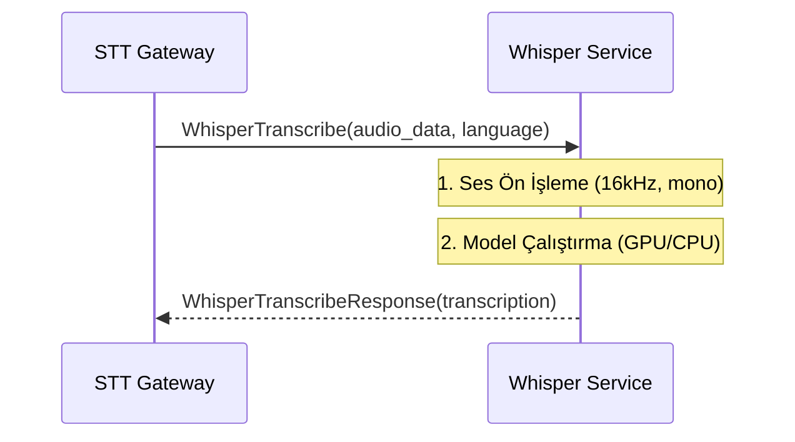

# 🤫 Sentiric STT Whisper Service - Mantık ve Akış Mimarisi

**Stratejik Rol:** Yüksek performanslı ve yerel (on-premise/GPU) ortamlara optimize edilmiş, saf Konuşma Tanıma yeteneğini sunar. Sadece STT Gateway'den gelen ham ses verisini işleyip metin döndürmekten sorumludur.

---

## 1. Temel Akış: Transkripsiyon (WhisperTranscribe)

## 2. Optimizasyon
* Model Caching: Model dosyaları (large-v3, medium) Docker volume'ler aracılığıyla kalıcı olarak saklanmalıdır (Hugging Face cache).
* Donanım Kullanımı: CUDA/GPU desteği öncelikli olmalıdır, ancak WHISPER_DEVICE ayarı ile CPU'da da çalışabilir.
* Tek Modellik Odak: Bu servis yalnızca Whisper'a odaklanır. Protokol normalleştirme veya karmaşık yönlendirme yapmaz.