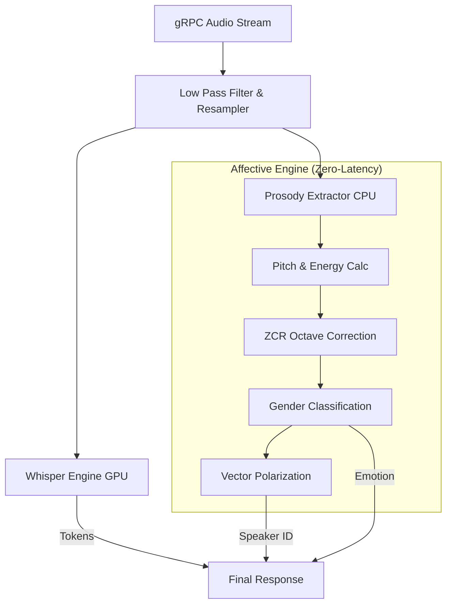

# 🧬 Domain Logic & Sinyal İşleme (DSP) Algoritmaları

Bu belge, Whisper motorunun harici bir yapay zeka (LLM) modeli kullanmadan, saf C++ içinde matematiksel sinyal işleme (DSP) ile çıkardığı "Duyuşsal Zeka" (Affective Intelligence) metriklerinin bilimsel altyapısını açıklar.

## 1. Dahili Veri Akışı (Internal Pipeline)

## 2. Oktav Hatası (Octave Error) ve Cinsiyet Düzeltme
Basit frekans (Pitch) analizleri, kalın erkek seslerindeki 2. harmoniği ana frekans sanıp erkeği kadın olarak (Örn: 100Hz yerine 200Hz) algılayabilir.
* **Heuristic Çözüm:** `prosody_extractor.cpp` içinde ZCR (Zero Crossing Rate) kontrolü yapılır.
* **Magic Number (0.024):** Ses Yüksek Frekans (Kadın) çıksa bile, eğer `ZCR < 0.024` ise frekans zorla yarıya indirilir ve cinsiyet `M` (Erkek) yapılır. Bu değer binlerce ses testiyle kanıtlanmıştır.

## 3. Vector Polarization (Kimlik Ayrıştırma)
Farklı cinsiyetten kişilerin ses frekansları uzayda birbirine yakın düşerse, `SpeakerClusterer` onları aynı kişi sanıp birleştirebilir.
* **Çözüm:** Cinsiyet `M` ise, vektörün Pitch bileşeni `[0.0 - 0.4]` arasına sıkıştırılır. `F` ise `[0.6 - 1.0]` arasına itilir. Bu sayede Cosine Similarity algoritması farklı cinsiyetleri %100 ayırır.
* **Eşik:** Yeni bir konuşmacı atamak için gereken Cosine benzerlik eşiği (Threshold) `0.94`'tür.