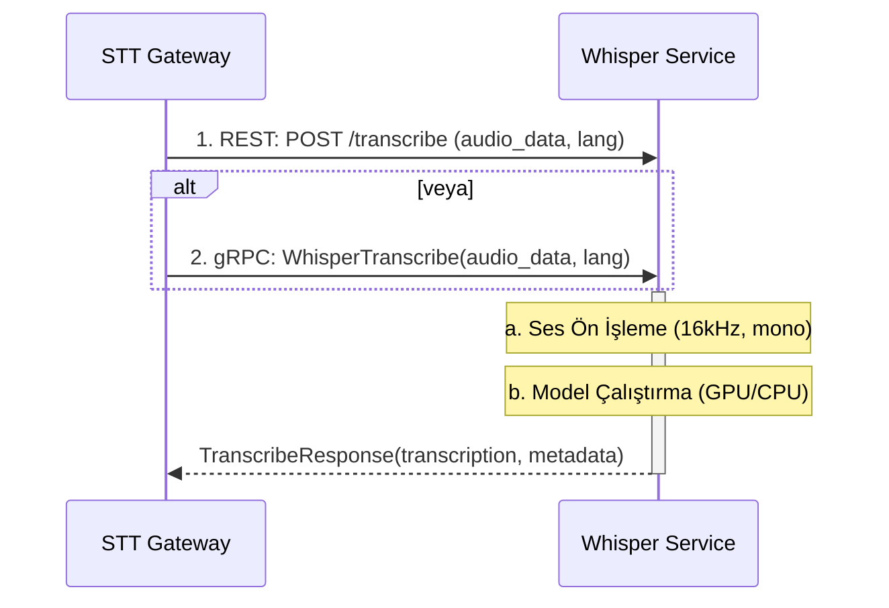

# 🤫 Sentiric STT Whisper Service - Mantık ve Akış Mimarisi

**Stratejik Rol:** Yüksek performanslı ve yerel (on-premise/GPU) ortamlara optimize edilmiş, saf Konuşma Tanıma (STT) yeteneğini sunar. Sadece `stt-gateway-service` gibi üst katman servislerinden gelen ham ses verisini işleyip metin döndürmekten sorumludur.

---

## 1. Temel Akış: Transkripsiyon (REST ve gRPC)

Servis, aynı transkripsiyon mantığını hem REST hem de gRPC arayüzleri üzerinden sunar.

## 2. Optimizasyon ve Sağlamlık

*   **Model Caching:** Model dosyaları (`large-v3`, `medium` vb.) `HF_HOME` ortam değişkeni ile belirtilen dizinde (varsayılan: `/app/model-cache`) saklanır. Bu dizin, Docker volume olarak bağlanarak modelin her başlatmada tekrar indirilmesi engellenir.
*   **Donanım Kullanımı:** `STT_WHISPER_SERVICE_DEVICE` ayarı ile `cuda` veya `cpu` seçimi yapılır. `auto` modu, CUDA varlığını otomatik olarak algılar.
*   **Hesaplama Hassasiyeti:** `STT_WHISPER_SERVICE_COMPUTE_TYPE` (`int8`, `float16` vb.) ayarı ile model, performans ve doğruluk arasında denge kuracak şekilde nicemlenir (quantized).
*   **Tek Odaklılık:** Bu servis yalnızca Whisper modelini çalıştırmaya odaklanır. Protokol normalleştirme, kimlik doğrulama veya karmaşık yönlendirme gibi görevleri üst katman servislere bırakır.
*   **Asenkron Başlatma:** Servis başlarken model yüklemesi ana süreci bloklamaz. Bu sırada gelen isteklere `/health` endpoint'i `503` (Service Unavailable) durum kodu ile yanıt vererek orkestrasyon araçlarına (örn. Kubernetes) henüz hazır olmadığını bildirir.

